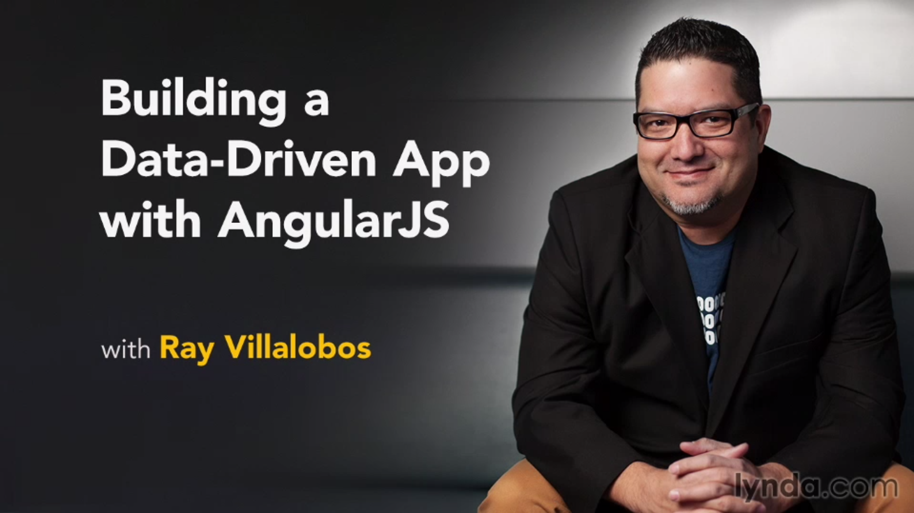

# Building a Data-Driven App with AngularJS

This is the repository for my course, [Building a Data-Driven App with AngularJS](http://www.lynda.com/AngularJS-tutorials/Building-Data-Driven-App-AngularJS/368918-2.html). The full course is available at [lynda.com](http://lynda.com).
- [Demo Website](http://chetkins.com)
- [My Personal Website](http://raybo.org)

## Course Description
Want to create web applications that can handle multiple users, registration, and real-time data? With these AngularJS tutorials, you'll be quickly building apps with advanced features like these. Ray Villalobos starts the course with a Git, Node.js, and GitHub setup that will get you off on the right foot. Next, learn how to create your first controller, connect a Firebase database, and read, push, and delete data from that database. Ray then shows you how to set up user registration with Firebase's simpleLogin service, so you can log users in and out and pass registration data back and forth from the app. With a few finishing touches, like custom directives, your Angular app will be ready to publish.

## Topics include:
- Installing Git and Node.js on Mac or Windows
- Installing AngularJS and its models
- Creating modules and routes
- Working with controllers
- Connecting to Firebase data
- Adding user registration
- Searching, filtering, and deleting records
- Creating custom directives

## Instructions
This repository has branches for each of the videos in the course. You can use the branch pop up menu in github to switch to a specific branch and take a look at the course at that stage. Or you can simply add `/tree/BRANCH_NAME` to the URL to go to the branch you want to peek at.

1. Make sure you have these installed
	- [node.js](http://nodejs.org/)
	- [git](http://git-scm.com/)
 	- [gulp](http://gulpjs.com/)
2. Clone this repository into your local machine using the terminal (mac) or Gitbash (PC) `> git clone https://github.com/planetoftheweb/angulardata.git`
3. CD to the folder `cd angulardata`
4. Run `> npm install` to install the project dependencies

For more help setting up a comprehensive Gulp.js workflow, check out [Web Project Workflows with Gulp.js, Git, and Browserify](http://www.lynda.com/Web-Web-Design-tutorials/Web-Project-Workflows-Gulpjs-Git-Browserify/154416-2.html).

## More Stuff
Check out some of my [other courses on lynda.com](http://lynda.com/rayvillalobos). You can also check out my [youtube channel](http://youtube.com/planetoftheweb), [follow me on twitter](http://twitter.com/planetoftheweb), or read [my blog](http://iviewsource.com).
